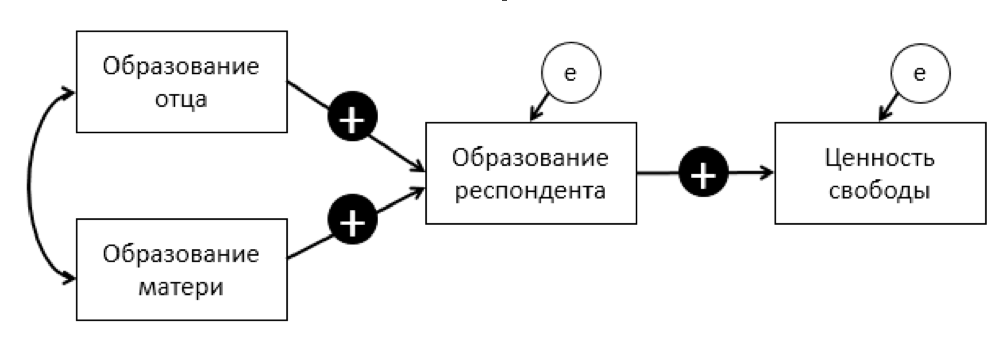

```{r setup, include=FALSE}
knitr::opts_chunk$set(eval = TRUE, include = TRUE)

library(learnr)
tutorial_options(exercise.eval = F)

library("lavaan")
library("haven")
library("semPlot")
library("DiagrammeR")

ess7 <- read_sav("www/ESS7e02_1.sav.zip")
Austria <- ess7[ess7$cntry == "AT",]

Austria$impfree <- LittleHelpers::reverse(Austria$impfree)
Austria$impfun <- LittleHelpers::reverse(Austria$impfun)


path1 <- sem( 'impfree ~ eduyrs
               eduyrs ~ eiscedf + eiscedm',
               data=Austria)

```


## 🤲 Пример

### Теоретическая модель

*Основная гипотеза:* Влияние образования отца и матери на ценности респондента полностью опосредовано образованием респондента, поскольку именно собственное образование человека является агентом, формирующим ценности свободы. Соответственно, прямое влияние образования родителей на ценность свободы респондента отсутствует.

*Дополнительные:* Образование отца положительно влияет на образование респондента. Образование матери положительно влияет на образование респондента. Образование респондента положительно влияет на ценность свободы.

Теоретическая модель, построенная на гипотезах, выглядит так:




### Множественная регрессия в lavaan

```{r message=FALSE, warning=FALSE}
library("lavaan")

regr <- sem('impfree ~ eduyrs + eiscedf + eiscedm',
             data=Austria)
             
regr

```

### Модель 1

```{r}
library("lavaan")

path1 <- sem( 'impfree ~ eduyrs
               eduyrs ~ eiscedf + eiscedm',
               data=Austria)

```

### Диаграмма

Пакеты `semPlot::semPaths`, `lavaanPlot::lavaanPlot`, `LittleHelpers::lav_to_graph`

```{r message=FALSE, warning=FALSE}
library("semPlot") # (в данный момент работает только новейшая версия, установка: remotes::install_github("SachaEpskamp/semPlot"))
semPaths(path1, 
         layout = "tree2", # логика расположения элементов
         rotation=2,      # поворот логики расположения
         nCharNodes = 0,  # насколько можно сократить названия переменных?
         whatLabels="est" # какие значения отражать на графике
         ) 
```

### Задание

- Поменяйте аргумент `layout` на `tree2`, а затем на `spring`;
- Добавьте аргумент `col= "red"`, чтобы поменять цвет прямоугольникков;
- Добавьте аргументы `node.width` и `node.height`, чтобы увеличить прямоугольники (значения по умолчанию =1)

```{r sem-plot, exercise = TRUE, exercise.eval = TRUE}
library("semPlot")
semPaths(path1, 
         layout = "tree", 
         rotation = 1,      
         nCharNodes = 0,  
         whatLabels = "est" 
         ) 

```

### Альтернативный вариант

```
library(LittleHelpers) # Установка - remotes::install_github("maksimrudnev/LittleHelpers")

lav_to_graph(path1)

```

```{r echo=FALSE}
library("DiagrammeR")
grViz('digraph lav_to_graph {
 node [shape=rect];
 rankdir=LR;
 layout=dot;
 forcelabels=true;
// Regressions and intercepts 
impfree [label= "impfree" ];
eduyrs [label= "eduyrs" ];
eduyrs -> impfree [style=bold label="0.03*"];
Resid_impfree  [shape = circle style = filled color=lightgrey fontsize=10 width=0.2, label = "&epsilon;"];
Resid_impfree -> impfree [color=grey];
eiscedf [label= "eiscedf" ];
eiscedf -> eduyrs [style=bold label="0.36*"];
Resid_eduyrs  [shape = circle style = filled color=lightgrey fontsize=10 width=0.2, label = "&epsilon;"];
Resid_eduyrs -> eduyrs [color=grey];
eiscedm [label= "eiscedm" ];
eiscedm -> eduyrs [style=bold label="0.26*"];
impfree[xlabel="&sigma;&sup2;&#61;0.92*"];
 eduyrs[xlabel="&sigma;&sup2;&#61;9.19*"];
 eiscedf[xlabel="&sigma;&sup2;&#61;5.46"];
 eiscedf -> eiscedm [ dir = "both" splines=curved constraint=false label=" 1.55 " fontsize = 10 ];
eiscedm[xlabel="&sigma;&sup2;&#61;8.28"];
 

// Add covariances of all exog variables


}')


```


```{r echo=F, message=FALSE, warning=FALSE}
# library(LittleHelpers) # Installation - devtools::install_github("maksimrudnev/LittleHelpers")
# 
# lav_to_graph(path1, rmarkdown=T)

```


### Изучим статистики согласия.

```{r}

path1

```

Критерий хи-квадрат (Minimum Function Test Statistic) показывает отличие матрицы предсказанной моделью от матрицы данных (предсказанной истинной моделью). Если значимость этого критерия близка к нулю (p меньше порогового 0,05 или 0,01), то модель не подходит к данным.

~~Model test baseline model - другой хи-квадрат!~~ Проверяет гипотезу о независимости переменных в модели, близкая к нулю значимость критерия говорит о наличии связи между переменными. 

Значения всех параметров находятся в разделе Parameter estimates.


###	Рассмотрим полученные параметры модели

**Только** если статистики согласия удовлетворительны.

```{r}

summary(path1)

```


### lavaan

<a href = "http://lavaan.ugent.be/tutorial/index.html" target="_blank" >LAtent VAriable ANalysis <span class="glyphicon">&#xe164;</span> </a>

`~` прямой эффект
`:=` непрямой эффект

Это не меняет саму модель, а только заставляет R вычислить дополнительные параметры (которые являются простой комбинацией существующих).


### Модель 1 с дополнительными параметрами

```{r message=FALSE, warning=FALSE}
library(lavaan)

path1 <- sem('
   # Параметр влияния образования на ценность назвали «ED»
   impfree ~ ED*eduyrs 
   
   # Аналогично добавили названия парамтров
   eduyrs ~ ED_ED_F*eiscedf + ED_ED_M*eiscedm 
   
   # Непрямой эффект образования матери
   indirect_M_ED := ED_ED_M * ED   
   
   ',
   data=Austria)

summary(path1)

```

### Задание

- Добавьте определение *непрямого эффекта* образования отца и посмотрите на результат.
- Значим ли непрямой эффект образования отца?

```{r path1, exercise = TRUE}

path2 <- sem('
   # Параметр влияния образования на ценность назвали «ED»
   impfree ~ ED*eduyrs 
   
   # Аналогично добавили названия парамтров
   eduyrs ~ ED_ED_F*eiscedf + ED_ED_M*eiscedm 
   
   # Непрямой эффект образования матери
   indirect_M_ED := ED_ED_M * ED   
   ',
   data=Austria)


```

```{r path1-solution}
# Непрямой эффект образования отца
# indirect_F_ED := ED_ED_F * ED

```


## Модификации и альтернативные гипотезы

Основную гипотезу пока нельзя считать подтвержденной! Высокое согласие модели с данными еще не говорит о том, что альтернативная модель не будет согласована с ними еще лучше. Это важный принцип в путевом анализе. Окончательный вывод можно сделать только сравнив между собой несколько моделей.


Для того, чтобы сформировать альтернативную модель, сформулируем альтернативные гипотезы:

1.	Образование матери оказывает и прямое, и непрямое влияние на ценности свободы (гипотеза частичной медиации)
2.	Образование отца оказывает и прямое, и непрямое влияние на ценности свободы  (гипотеза частичной медиации)

Построим модель для каждой альтернативной гипотезы, добавив прямое влияние образования матери на ценность свободы и повторив остальные шаги.


### Модель 2

- Добавьте прямой эффект образования матери на ценность свободы и назовите его "ED_M".
- Вычислите *общий (total) эффект* образования матери на ценности свободы сложив прямой и непрямой эффект.
- После этого снова запустите модель и посмотрите на результаты через `summary`. К предыдущим результатам должны были добавиться оценки прямого и общего эффектов.
- Улучшилось ли качество модели в соответствии с хи-квадратом (он уменьшился?)

```{r path2, exercise = TRUE}

library(lavaan)

path2 <- sem('

   impfree ~ ED*eduyrs
   
   # Аналогично добавили названия парамтров
   eduyrs ~ ED_ED_F*eiscedf + ED_ED_M*eiscedm 
   
   # Непрямой эффект образования матери
   indirect_M_ED := ED_ED_M * ED   
   
   # Непрямой эффект образования отца
   indirect_F_ED := ED_ED_F * ED 
   
   ',
   data=Austria)


```

```{r path2-solution}
   
   # Прямой эффект образования матери на 
   # impfree ~ ED_M*eiscedm

   # Определим общий эффект образования матери на 
   # ценность (то есть сумма прямого и непрямого эффектов)
   #  total_M_ED := ED_ED_M * ED + ED_M 

```


### Модель 3

- Добавьте прямой эффект образования отца на ценность свободы и назовите его "ED_F".
- Вычислите *общий (total) эффект* образования отца на ценности свободы сложив прямой и непрямой эффекты.
- Посмотрите на результаты через `summary`. К предыдущим результатам должны были добавиться оценки прямого и общего эффектов образования отца.
- Улучшилось ли качество модели в соответствии с хи-квадратом?

```{r path3, exercise = TRUE}
library(lavaan)


path3 <- sem('
   # прямые эффекты
   impfree ~ ED*eduyrs + ED_M*eiscedm
   
   # эффекты образования родителей на образование респондента
   eduyrs ~ ED_ED_F*eiscedf + ED_ED_M*eiscedm 
   
   # Непрямой эффект образования матери
   indirect_M_ED := ED_ED_M * ED   
   
   # Общий эффект образования матери на 
   # ценность (то есть сумма прямого и непрямого эффектов)
    total_M_ED := ED_ED_M * ED + ED_M 
   
   # Непрямой эффект образования отца
   indirect_F_ED := ED_ED_F * ED 
   
   ',
   data=Austria)


```

```{r path3-solution, eval=F}
   
   # прямой эффект образования отца
   # impfree ~ ED_F*eiscedf

   # общий эффект образования отца на 
   # ценность (то есть сумма прямого и непрямого эффектов)
   # total_F_ED := ED_ED_F * ED + ED_F 

```

### Сравнение вложенных моделей

Являются ли полученные модели вложенными?

<div class="greenblock">
Вложенной (nested) моделью называется модель с одним или более пропущенными переменными/параметрами. Редуцированная модель вложена в полную. Вложенные модели имеют один и то же набор наблюдаемых переменных, но различаются по количеству параметров.</div>

```{r lrt-setup, include = FALSE}
path1 <- sem('
   # Параметр влияния образования на ценность назвали «ED»
   impfree ~ ED*eduyrs 
   
   # Аналогично добавили названия парамтров
   eduyrs ~ ED_ED_F*eiscedf + ED_ED_M*eiscedm 
   
   # Непрямой эффект образования матери
   indirect_M_ED := ED_ED_M * ED   
   
   ',
   data=Austria)

path2 <- sem('

   impfree ~ ED*eduyrs
   
   # Аналогично добавили названия парамтров
   eduyrs ~ ED_ED_F*eiscedf + ED_ED_M*eiscedm 
   
   # Непрямой эффект образования матери
   indirect_M_ED := ED_ED_M * ED   
   
   # Непрямой эффект образования отца
   indirect_F_ED := ED_ED_F * ED 
   
  # Прямой эффект образования матери на 
   impfree ~ ED_M*eiscedm

   # Определим общий эффект образования матери на 
   # ценность (то есть сумма прямого и непрямого эффектов)
    total_M_ED := ED_ED_M * ED + ED_M 
   
   ',
   data=Austria)

path3 <- sem('
   # прямые эффекты
   impfree ~ ED*eduyrs + ED_M*eiscedm
   
   # эффекты образования родителей на образование респондента
   eduyrs ~ ED_ED_F*eiscedf + ED_ED_M*eiscedm 
   
   # Непрямой эффект образования матери
   indirect_M_ED := ED_ED_M * ED   
   
   # Общий эффект образования матери на 
   # ценность (то есть сумма прямого и непрямого эффектов)
    total_M_ED := ED_ED_M * ED + ED_M 
   
   # Непрямой эффект образования отца
   indirect_F_ED := ED_ED_F * ED 
   
   # прямой эффект образования отца
   impfree ~ ED_F*eiscedf

   # общий эффект образования отца на 
   # ценность (то есть сумма прямого и непрямого эффектов)
    total_F_ED := ED_ED_F * ED + ED_F 
   
   ',
   data=Austria)

```


```{r lrt, exercise = TRUE}

lavTestLRT(path1, path2, path3)

```

Какая из моделей лучше подходит к данным?


### Являются ли эти две модели вложенными?

```{r echo=FALSE}

DiagrammeR::grViz(diagram = '
   digraph world {
   size="7,7";
 
   rankdir=LR;
   node [shape = box];
   
   subgraph cluster_1 {
 label = "B"
   	  edu [label=education]
   	  edu_f [label=edu_father]
   	  edu_m[label=edu_mother]
   	  value_f[label=value_freedom]

edu_m -> value_f
edu_f -> edu
edu_m -> edu
edu -> value_f

}
   
subgraph cluster_0 {
 label = "A"
   	  education
   	  edu_father 
   	  edu_mother
   	  value_freedom

edu_father -> value_freedom
edu_father -> education
edu_mother -> education
education -> value_freedom

}


   }
')


```


### Возможны ли эквавивалентные модели?


## 👉 Самостоятельное задание 

<!-- {data-progressive=FALSE} -->

Количество выпиваемого в неделю алкоголя (`alcwkdy` и `alcwknd`) среди австрийцев зависит от образования (`eduyrs`), возраста (`agea`), гендера (`gndr`), частоты  встреч с друзьями (`sclmeet`) и ценности гедонизма (`impfun`) - в Австрии.

<!-- [Данные 7 раунда ESS]("data/ESS7e02_1.sav") -->


### Проверьте гипотезу 1

- Влияние гендера на употребление алкоголя частично опосредовано ценностями гедонизма.

При проверке учитывайте все релевантные (перечисленные выше) переменные.

```{r alcohol1, exercise=TRUE}

# Austria$alcohol <- ...

# model1 <- sem(...
#                   ,
#                   Austria
# )


```

```{r alcohol1-hint}
# Для проверки частичной медиации нужно построить 
# модель с прямым и непрямым эффектом и оценить 
# их значимость.

```

- Удовлетворительны ли статистики согласия?
- Значимы ли интересующие нас коэффициенты?

###  ❓

```{r letter-a, echo=FALSE}
question("Подтвердилась ли Гипотеза 1?",
  answer("да"),
  answer("нет", correct = TRUE),
  answer("частично"),
  incorrect = "Неверно. Непрямой эффект оказался незначим (p>.05), а прямой эффект - значим, следовательно, влияние гендера на употребление алкоголя не опосредовано ценностями гедонизма.",
 correct = "Верно. Непрямой эффект оказался незначим (p>.05), а прямой эффект - значим, следовательно, влияние гендера на употребление алкоголя не опосредовано ценностями гедонизма."
)
```


### Проверьте гипотезу 2

- Влияние возраста на употребление алкоголя полностью опосредовано частотой встреч с друзьями.

```{r alcohol2, exercise=TRUE}

# Austria$alcohol <- ...

# model1 <- sem(...
#                   ,
#                   Austria
# )

```

```{r alcohol2-hint-1}
# Полная медиация подразумевает отсутствие прямого эффекта.

```

```{r alcohol2-hint-2}
# Для проверки полной медиации нужно построить две модели 
# и сравнить их между собой.
```


- Удовлетворительны ли статистики согласия?
- Значимы ли интересующие нас коэффициенты?

###  ❓

```{r letter-b, echo=FALSE}
question("Подтвердилась ли Гипотеза 2?",
  answer("да"),
  answer("нет", correct = TRUE),
  answer("частично"),
  incorrect = "Неверно. Непрямой эффект оказался незначим (p>.05), а прямой эффект - значим. Дополнительно, хи-квадрат значимо выше в модели с прямым эффектом, по сравнению с моделью без прямого эффекта возраста. Следовательно, влияние возраста на употребление алкоголя не опосредовано частотой встреч с друзьями (не говоря уже о полной медиации).",
 correct = "Верно. Непрямой эффект оказался незначим (p>.05), а прямой эффект - значим. Дополнительно, хи-квадрат значимо выше в модели с прямым эффектом, по сравнению с моделью без прямого эффекта возраста. Следовательно, влияние возраста на употребление алкоголя не опосредовано частотой встреч с друзьями (не говоря уже о полной медиации)."
)
```


- Каковы возможные прямые эффекты?
- Какие непрямые эффекты тут возможны?


### Проверьте гипотезу 3

- Влияние возраста на употребление алкоголя  опосредовано уровнем образования, эффект которого в свою очередь опосредован частотой встреч с друзьями (гипотеза последовательной медиации).

```{r alcohol3, exercise=TRUE}

# Austria$alcohol <- ...
# 
# model2 <- sem(...
#                    ,
#                    Austria
# )

```

```{r alcohol3-hint-1}

# Эффект последовательной медиации вычисляется так же 
# как и для парной - умножением коэффициентов в цепочке, 
# ведущей от возраста к алкоголю.

```


- Удовлетворительны ли статистики согласия?
- Значимы ли интересующие нас коэффициенты?
- Какие альтернативные гипотезы можно преложить?

### ❓

```{r letter-c, echo=FALSE}
question("Подтвердилась ли Гипотеза 3?",
  answer("да"),
  answer("нет", correct = TRUE),
  answer("частично"),
  incorrect = "Неверно. Все возможные непрямые эффекты, соединяющие возраст и алкоголь через образование и частоту встреч незначимы.",
 correct = "Верно. Все возможные непрямые эффекты, соединяющие возраст и алкоголь через образование и частоту встреч незначимы."
)
```


- Каковы возможные прямые эффекты?
- Какие непрямые эффекты тут возможны?
- Удовлетворительно ли качество модели?


### Какие еще гипотезы возможны?

Сформулируйте гипотезы и ответьте на вопросы:

-	Какие из переменных в модели являются эндогенными, а какие экзогенными?
-	Сколько параметров в этой модели?
-	Сколько уникальных дисперсий и ковариаций?
-	Сколько степеней свободы?
-	Идентифицирована ли эта модель?
-	Это модель полной или частичной медиации?
-	Все ли гипотезы проходят четыре условия каузальности?

```{r echo=FALSE}

DiagrammeR::grViz(diagram = '
   digraph world {
   size="7,7";
   rankdir=LR;
   node [shape = box];
   edge [color=invis];
   	{rank=min; 
   	  agea[label="возраст"]
   	  gndr [label="гендер"]
   	  eduyrs [label="образование"]
   	}
      
         impfun[label="гедонизм"]
         sclmeet[label="встречи с друзьями"];
         
    	
         alcohol[label="Кол-во упоребляемого \nалкоголя"]
   
         eduyrs -> alcohol
         gndr-> alcohol
         agea-> alcohol
         impfun-> alcohol
         sclmeet-> alcohol

      }
')


```

### Модификационные индексы

Рассмотрите **модификационные индексы**, которые послужат подсказками для ре-спецификации модели (Показывает насколько уменьшится хи-квадрат модели при добавлении какой-либо взаимосвязи). Для вывода значений модификационных индексов можно воспользоваться методом modindices().

Обратите внимание, что ~~не все~~ из них имеют содержательный смысл. 

- Какие параметры следует добавить в модель, если слепо верить модификационным индексам? Добавьте этот параметр в модель и сравните с исходной моделью - улучшилось ли качество?

```{r modind, exercise = TRUE}
Austria$alcohol = Austria$alcwkdy + Austria$alcwknd

m1 <- sem("alcohol ~ agea + sclmeet + FUN*impfun + gndr + eduyrs;
           impfun ~ gndr;


    ", Austria, 
    missing = "ML")

modindices(m1, sort = TRUE)

```


### Моделирование

- Постройте модели, которые могут проверить вашу гипотезу.
- Сравните модели между собой (сравнивать можно только вложенные!)
- Сделайте вывод по каждой из гипотез.


```{r alt-alco-model, exercise = TRUE}

Austria$alcohol = Austria$alcwkdy + Austria$alcwknd

m5 <- sem("alcohol ~ agea + sclmeet + FUN*impfun + gndr + eduyrs;",
          Austria, 
          missing = "ML")


```

### Возможны ли эквавивалентные модели?


### 😲 Решения

```{r eval=TRUE, include=TRUE}

# Проверка гипотезы 1

Austria$alcohol = Austria$alcwkdy + Austria$alcwknd

m1 <- sem("alcohol ~ agea + sclmeet + HED*impfun + gndr + eduyrs;
impfun ~ HED_GEN*gndr;

indirect_fun := HED_GEN * HED;

    ", Austria, missing = "ML")
summary(m1)
semPaths(m1)


# Проверка гипотезы 2

m2 <- sem("alcohol ~ SC*sclmeet + impfun + gndr + eduyrs;
            sclmeet	~	SC_AG*agea
            indir := SC_AG * SC

    ", Austria)
   
m3 <- sem("alcohol ~ agea + SC*sclmeet + impfun + gndr + eduyrs;
            sclmeet ~ SC_AG*agea;
            indir := SC_AG * SC
    ", Austria)

summary(m2)
summary(m3)
semPaths(m2)
semPaths(m3)

lavTestLRT(m2, m3)


# Проверка гипотезы 3

m4 <- sem("alcohol ~ AGE*agea + MEET*sclmeet + impfun + gndr + EDU*eduyrs;
            eduyrs ~ EDU_AGE*agea;
            sclmeet ~ MEET_EDU*eduyrs;
            
            indir1 := EDU_AGE * MEET_EDU * MEET
            indir2 := EDU_AGE * EDU
            total := indir1 + indir2 + AGE
    ", Austria)
summary(m4)


# Дополнительная гипотеза: эффекты гендера, возраста и образования на употребление алкоголя частично опосредованы гедонизмом и частотой встреч  с друзьями 

m5 <- sem("alcohol ~ AGE*agea + MEET*sclmeet + HED*impfun + GEN*gndr + EDU*eduyrs;
  
            sclmeet ~ MEET_EDU*eduyrs + MEET_AGE*agea + MEET_GEN*gndr;
            impfun  ~ HED_EDU*eduyrs + HED_AGE*agea + HED_GEN*gndr;
            sclmeet ~ MEET_HED*impfun;
            
            EDU_indir1 := MEET_EDU * MEET;
            EDU_indir2 := HED_EDU * MEET_HED * MEET;
            EDU_indir3 := HED_EDU * HED;
            EDU_total  := EDU + EDU_indir1 + EDU_indir2 + EDU_indir3;
            
            AGE_indir1 := MEET_AGE * MEET;
            AGE_indir2 := HED_AGE  * MEET_HED * MEET;
            AGE_indir3 := HED_AGE  * HED;
            AGE_total  := AGE + AGE_indir1 + AGE_indir2 + AGE_indir3;
            
            GEN_indir1 := MEET_GEN * MEET;
            GEN_indir2 := HED_GEN  * MEET_HED * MEET;
            GEN_indir3 := HED_GEN  * HED;
            GEN_total  := GEN + GEN_indir1 + GEN_indir2 + GEN_indir3;

    ", Austria)
semPaths(m5, layout = "tree2", 
         rotation = 2, 
         nCharEdges=0,
         nCharNodes=0)

summary(m5)

```


### Bonus

Постройте гипотезы и соответствующие модели с двумя синхронными медиаторами.


